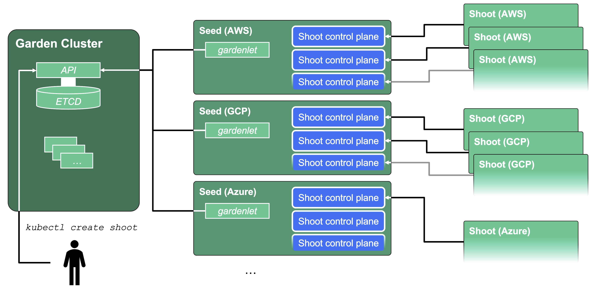

# Architecture of Gardener Syncer

This document contains the results of an investigation for a possible solution to provide available
Gardener Seeds region information for Kyma Control Plane (KCP) services as requested in [issue #629](https://github.com/kyma-project/infrastructure-manager/issues/629).

## Technical Context
The Kyma Runtime is created on top of the Gardener System as a Gardener Shoot cluster.
For every Kubernetes Shoot cluster, its Control Plane services are located in a separate Kubernetes cluster named Gardener Seed.
There can be multiple Gardener Shoots managed by a single Gardener Seed cluster.



The set of active Seed clusters is managed on the Gardener System level.
During shoot creation, the Gardener system assigns a Seed for a Shoot based on internal configuration and availability of resources.
When the Shoot is fully created, the information about the used Seed can be read from the Shoot CR instance.

> [!NOTE]
> Kyma Control Plane provisioning services may actually specify the Seed name for Shoot during creation, but they provide initial empty value
> as they are not aware which Gardener seeds are available in the Gardener System.

## Problem description:

The number of available Seed clusters is limited, and they exist only in several cloud provider regions.
It is highly probable that for the provisioned Kyma runtime, the actual Seed cluster (assigned by Gardener) will be located in a different cloud region than the Shoot cluster.
Such a situation can be problematic.
In some use cases, users require the Kyma runtime to be fully located in the same cloud provider region — both the underlying Gardener Shoot and its Seed.
There is a special checkbox to enforce this requirement during the initial setup of the Kyma runtime.


As of now, when this checkbox is enabled, the KEB service is not able to validate if the actual Gardener Seed is available in the chosen region before provisioning starts.
In such a case, the provisioning operation fails because of a missing Seed, and this fact is reported to the user after two hours after when provisioning times out.

## Business Requirements

- The list of cloud provider regions where Gardener Seeds are available (Gardener seed region data) should be provided for provisioning services in the Kyma Control Plane cluster. This list should be a subset of the full list of regions where the Kyma runtime can be created normally.
- When a checkbox "enforce same location for Seed and Shoot" is selected, the Kyma provisioning request should be processed only if, for a chosen provider region, a Seed is available. When Seed in the same provider region as Shoot cannot be found, the request should fail immediately.
- The seed region data in the list should be refreshed regularly with data from the Gardener System
- The seed region data should be provided for Kyma Control Plane services responsible for creating the Kyma runtime.

## Solution Proposal
- Gardener Seed region data for all providers will be stored inside a single ConfigMap in the `kcp-system` namespace. Proposed name for ConfigMap is `gardener-seeds-cache`
- The ConfigMap data will be updated regularly by the Kubernetes CronJob. Proposed name for the job is `gardener-syncer-job`
- The CronJob will run once a day a Golang program that will fetch the seed information data from the Gardener System and update the ConfigMap with the new data.


## Implementation Details
The Golang program will implement the following logic:
- Fetch the list of all available Gardener Seeds from the Gardener System API for all providers
- Filter out Seeds using criteria:
  - Seed cannot be deleted (`DeletionTimestamp == nil`)
  - Seed must be visible for scheduling (`Spec.Settings.Scheduling.Visible == true`)
  - Seed cannot have any unknown taints (see note below)
  - Seed status should have condition `"GardenletReady" == "True"`
  - If Seed has Backup specified, Seed status has the condition `"BackupBucketsReady" == "True"`
- Get the Region of every Seeds from the `seed.Spec.Provider.Region` field.
- Group the list of regions by cloud provider and store in the ConfigMap.

> [!Note]
> We decided that the best approach is to exclude out seeds with unknown taints from the dataset.
> Taints on Seeds are applied intentionally to restrict the possibility of using such Seeds to only Shoots with some specific configuration.
> As KIM service does not know how to set up Shoot to be compatible with Seed with unknown taint, we cannot use such Seed for provisioning. 
>
> On the other hand, there are some known taints that should be allowed to be used for provisioning.
> When a Seed is marked with such a taint, we can be sure that a Shoot provided for this Seed will be configured correctly.
> To support such known taints, we should provide its list as a parameter for the job Golang program and allow
> for processing them during the generation of seed region data. This will be done in https://github.com/kyma-project/gardener-syncer/issues/53.

## Data Format Proposal
Assumptions: 
- The data for all cloud providers will be stored in a single ConfigMap
- Following cloud providers will be supported: AWS, Azure, GCP, OpenStack
- The data will be stored in a YAML format

Proposed structure of the ConfigMap:

```yaml
apiVersion: v1
data:
  aws: |-
    seedRegions:
    - ap-southeast-1
    - ap-southeast-2
    - ap-northeast-2
    - eu-central-1
    - eu-north-1
    - eu-west-1
    - eu-south-1
    - us-east-1
    - us-west-2
  azure: |-
    seedRegions:
    - australiaeast
    - switzerlandnorth
    - westeurope
    - westus2
    - eastus
  gcp: |-
    seedRegions:
    - asia-south1
    - europe-west1
    - us-central1
  openstack: |-
    seedRegions:
    - eu-de-1
    - na-us-1
kind: ConfigMap
metadata:
  name: gardener-seeds-cache
  namespace: kcp-system
```

## Summary

A proposed solution is to implement a Golang program that will fetch the Gardener Seeds region data from the Gardener System API and store it in a ConfigMap in the `kcp-system` namespace.
This data will be updated regularly by a Kubernetes CronJob.
The ConfigMap will contain the list of available Gardener Seeds regions grouped by cloud provider.
The solution will ensure that Kyma Control Plane services can access the region data where Gardener Seeds are available and can use it to validate provisioning requests.


