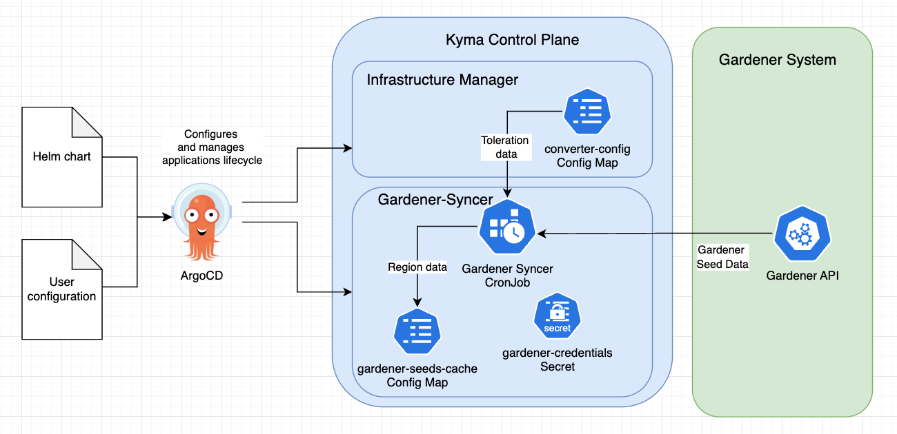

# Installation and Setup of Gardener Syncer

## Context

The Gardener Syncer is an application that periodically fetches available Gardener Seed data and stores a list of Seed regions in a ConfigMap within the Kyma Control Plane.
This information is essential for Kyma Control Plane services to validate Kyma Runtime provisioning parameters.

When the user enables "shoot in the same region as seed" feature, KEB service will use the Gardener Syncer ConfigMap to check if a Seed is available in the same region as the Shoot cluster. 
If there is no Seed available, KEB service will interrupt the provisioning process and will return an error to the user.

## Installation   

The Gardener Syncer is deployed as a Kubernetes CronJob in the Kyma Control Plane. It is configured to run periodically with user configured schedule.
Gardener Syncer is installed on the Kyma Control Plane using Helm chart provided in the separate repository.

This Helm chart includes all necessary configurations to deploy the Gardener Syncer job and contains some values that can be customized to fit the target environment.
The chart is prepared as an ArgoCD application and can be installed using the [ArgoCD](https://argoproj.github.io/) UI or CLI.

The full list of Helm Chart parameters can be found in the [Configuration documentation](./configuration.md)

## Dependencies for loading Taint toleration data

The Gardener Syncer job requires an additional configuration file to get the information on Taint toleration. 
When processed Seed has a Taint, and the toleration for it is not present in the configuration file, such Seed will be skipped from processing.

The toleration configuration file is mounted from a ConfigMap named `gardener-shoot-converter-config` in the `kcp-system` namespace.
Because this ConfigMap is a part of the Infrastructure Manager (KIM) Helm ArgoCD application, KIM must always be present in the environment before Gardener Syncer Job is executed.
If the configuration file is detected as missing during job execution, the Gardener Syncer Job will fail.

## Runtime environment prerequisites

- Access to the Kyma Control Plane where the Gardener Syncer will run.
- Access to the Gardener Cluster API with a valid kubeconfig file.
- Access to Kyma Infrastructure Manager converter configuration file. 
